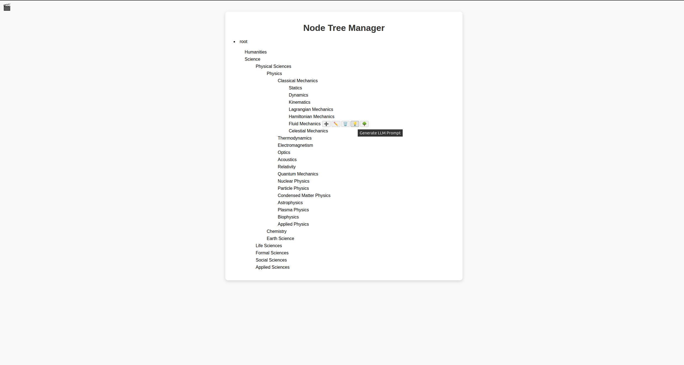
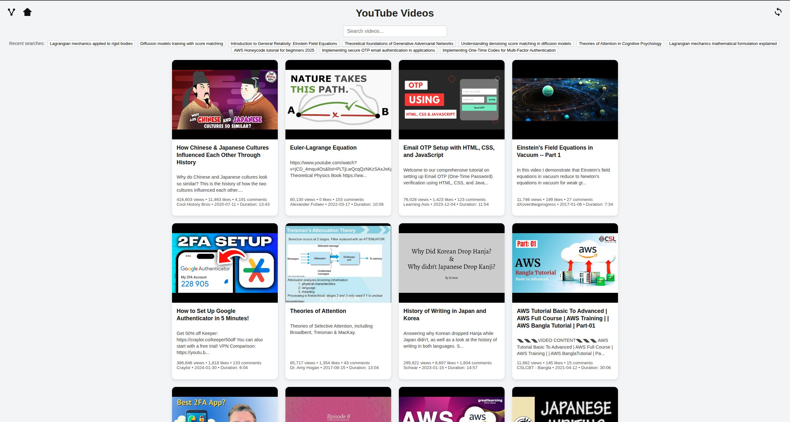

# YouTube Recommender

A personalized YouTube video recommender that leverages **knowledge graphs** and **LLM-generated queries** to explore topics and discover relevant videos.

---

## 🚀 Getting Started

Run the app using:

```bash
python start.py
```

This will:

1. Create a Python virtual environment.
2. Install necessary pip packages.
3. Open your web browser to the correct URL.
4. Start the Flask app in your current shell.

---

## 🖥 App Overview

The app has **two main pages**:

### 1. Nodes Page

- Uses a **knowledge tree** to explore topics and expand information.
- Click a node to **copy an LLM prompt** to expand the graph.
- From a node, you can also generate multiple queries to explore the subject further.
- Once you select a search prompt, navigate to the **Videos Page** using the top-left icon.

**Preview:**



---

### 2. Videos Page

- Shows a **random selection of search results** from your previously generated queries.
- **Filters applied:** videos must be at least **5 minutes long** and have **5,000+ views** to improve relevance.
- You can also search for **new videos** by entering a query in the search box.
- The results are designed to be somewhat relevant to the subjects you explored in the nodes page.

**Preview:**



---

## ⚠️ Setup Notes

### YouTube API

- You must have a **YouTube API token** associated with your Google account to search for videos.
- Create a file `youtube_recommender/config.json` with the following format:

```json
{
  "YOUTUBE_API_KEY": "YOUR_YOUTUBE_API_KEY"
}
```

> Note: Without an API key, YouTube may flag your IP as a bot.

### Optional ChatGPT Integration

- You can integrate an LLM via OpenAI's API by creating `nodes/config.json`:

```json
{
  "CHATGPT_API_KEY": "YOUR_CHATGPT_API_KEY"
}
```

- This is optional — you can also **manually copy LLM prompts** from the Nodes page without needing an API key.

---

## 🎯 Features

- **Knowledge graph navigation** for topic exploration.
- **LLM-generated queries** to help discover new videos.
- **Filtered, randomized video results** to improve relevance.
- Optional **ChatGPT integration** for automated prompt expansion.

---

## 💻 Tech Stack

- Python 3
- Flask
- JavaScript / HTML / CSS (frontend)
- YouTube Data API
- Optional: OpenAI GPT API

---

## 📌 Notes

- Designed for personal use; usage may be limited by YouTube API quotas.
- Works best with a valid YouTube API key and optional LLM API token.
- The experience can be fully free if you manually copy/paste prompts instead of using ChatGPT integration.
